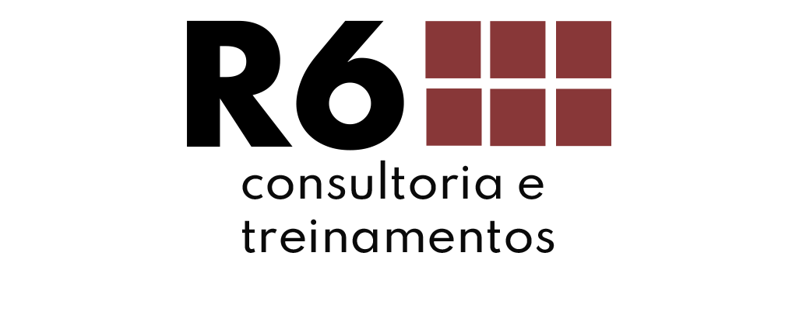

```{r setup, include=FALSE}
options(htmltools.dir.version = FALSE)
```

class: middle, center, inverse
# Sobre a Curso-R

---
class: middle, center

# A empresa

.pull-left[
```{r, echo = FALSE, out.width="70%"}
knitr::include_graphics("https://d33wubrfki0l68.cloudfront.net/295643c6243701ae6a9bac3fb8ad467ff0ce3c84/d1785/img/logo/cursor1-41.png")
```

<br>
<br>

```{r, echo = FALSE, out.width="70%"}

```
]

.pull-right[
```{r, echo = FALSE, out.width="70%"}
knitr::include_graphics("img/produtos.png")
```
]

### [www.curso-r.com](https://www.curso-r.com)

---

# Nossos cursos

.smaller[
```{r, echo = FALSE}
templatesR6::criar_slide_nossos_cursos()
```
]

---
class: middle, center, inverse
# Sobre o curso

---
# Material

<center>

<br>

Nosso livro Ciência de Dados em R:

<br>

<a href='https://livro.curso-r.com/'>https://livro.curso-r.com/</a>

<br>
<br>

O Zen do R

<br>

<a href='https://curso-r.github.io/zen-do-r/'>https://curso-r.github.io/zen-do-r/ </a>

<br>
<br>

Também temos um blog: 

<br>

<a href='http://curso-r.com/blog/'>http://curso-r.com/blog/ </a>

</center>


---
# Dinâmica curso

- As aulas terão um bloco teórico e um bloco prático.

- Teremos diversos exercícios opcionais e uma entrega final obrigatória para serem feitos "em casa".

- Os exercícios não terão prazo nem nota. O objetivo deles será gerar dúvidas, para que possamos melhor orientá-las(los) durante o curso. Portanto, **não é preciso entregar os exercícios**.

- A entrega final será um pequeno projeto englobando diversos conceitos abordados durante o curso. O prazo da entrega final será de 2 semanas após a última aula.

- O certificado será emitido para os alunos que fizerem **entrega final**.

---
# Pratique

- Não se preocupe com estilos de estudo. Use o que te deixar mais confortável.

- Estude um pouco todo dia. Se você tem apenas uma hora para estudar na semana, faça 3 sessões de 20 minutos em dias diferentes.

- Se teste! Coloque em prática o que você aprendeu resolvendo exercícios ou inserindo o R no seu dia-a-dia.

<br>
<br>

### Referência

[Nahurhodo 205 - Powerpoint é útil para a aprendizagem?](https://www.b9.com.br/shows/naruhodo/naruhodo-205-powerpoint-e-util-para-a-aprendizagem/)

---
# Tirando dúvidas

 - **Não existe dúvida idiota**.
 
 - Nem sempre é trivial fazer a pergunta certa para que outra pessoa esclareça a sua dúvida. Neste curso, **vamos mostrar melhores práticas na hora de fazer perguntas sobre programação**.
 
 - Fora do horário de aula ou monitoria:
     - perguntas gerais sobre o curso deverão ser feitas no Classroom.
     
     - perguntas sobre R, principalmente as que envolverem código, deverão ser enviadas no [nosso discourse](https://discourse.curso-r.com/).

- [Veja aqui dicas de como fazer uma boa pergunta](https://discourse.curso-r.com/t/como-escrever-uma-boa-pergunta/542).

---
# Extras

- Teremos monitoria duas vezes pode semana, sempre 30 minutos antes do início das aulas.

- A gravação das aulas ficará disponível no Google Classroom por 1 ano após o final do curso.
