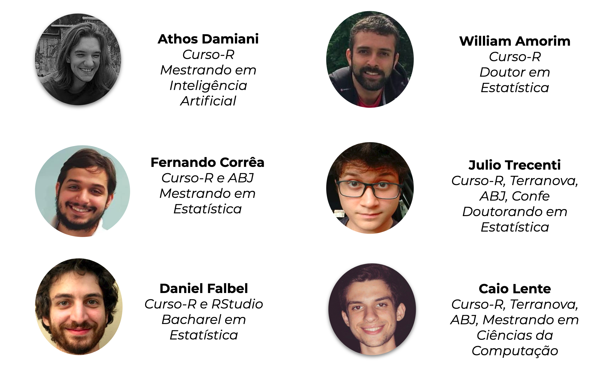

```{r setup, include=FALSE}
options(htmltools.dir.version = FALSE)
```

class: middle, center

# Sobre a Curso-R

---

## Curso-R

</img>

---

## Linha do tempo

<center>
</img>
</center>

---
## Nossos cursos

```{r, echo = FALSE}
tab <- tibble::tribble(
  ~curso_nome, ~curso_url, ~curso_tipo,
  "R para Ciência de Dados I", "https://www.curso-r.com/cursos/r4ds-1/", "Programação em R",
  "R para Ciência de Dados II","https://www.curso-r.com/cursos/r4ds-2/", "Programação em R",
  "Introdução ao R com C++", "https://www.curso-r.com/cursos/rcpp/", "Programação em R",
  "Regressão linear", "https://www.curso-r.com/cursos/regressao-linear/", "Modelagem",
  "Machine Learning", "https://www.curso-r.com/cursos/intro-machine-learning/", "Modelagem",
  "XGBoost", "https://www.curso-r.com/cursos/xgboost/", "Modelagem",
  "Deep Learning", "https://www.curso-r.com/cursos/deep-learning/", "Modelagem",
  "Web scraping", "https://www.curso-r.com/cursos/web-scraping/", "Extração de dados",
  "Dashboards", "https://www.curso-r.com/cursos/dashboards/", "Comunicação e automação",
  "Deploy", "https://www.curso-r.com/cursos/deploy/", "Comunicação e automação"
)

templatesR6::criar_slide_nossos_cursos(tab)
```

---
class: middle, center

# Sobre o curso

---
## Dinâmica curso

- As aulas serão (quase totalmente) expositivas.

- Teremos diversos exercícios e uma entrega final para serem feitos "em casa".

- Os exercícios não serão avaliações, isto é, não terão prazo nem nota. O objetivo deles será gerar dúvidas, para que possamos melhor orientá-las(los) durante o curso. Portanto, **não é preciso entregar os exercícios**.

- A entrega final será um pequeno projeto englobando diversos conceitos abordados durante o curso. O prazo da entrega final será de 2 semanas após a última aula.

- O certificado será emitido para os alunos que fizerem **entrega final**. A entrega final será uma composição de todos os exercícios. 

---
## Extras

- Teremos monitoria duas vezes pode semana, sempre 1 hora antes do início das aulas (ter e qui, das 18h às 19h).

- Além das aulas, teremos alguns conteúdos extras, tanto em texto quanto em vídeo.

- A gravação das aulas ficará disponível no Google Classroom por 1 ano após o final do curso.

