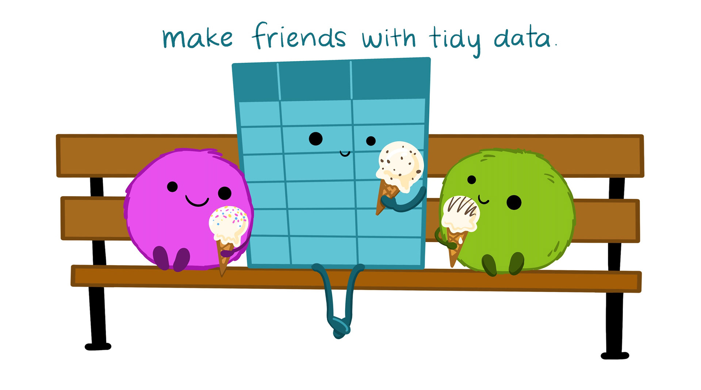

```{r setup, include=FALSE}
options(htmltools.dir.version = FALSE)
knitr::opts_chunk$set(comment = "#>")
options(dplyr.print_min = 5, dplyr.print_max = 5, dplyr.width = 70)
```

class: middle, center
# Iniciar gravação!

---
class: middle, center, inverse
# tidyr

---
# Motivação

Um dos conceitos mais importantes do tidyverse é o de **dados tidy** ("dados
arrumados"). Na prática, uma tabela tidy tem três propriedades importantes:

- Cada coluna é uma variável.

- Cada linha é uma observação.

- Cada célula é um único valor.

Essa definição garante uma maneira consistente de se referir a variáveis (nomes
das colunas) e observações (índices das linhas). Além disso, o tidyverse foi
construído pensando em tabelas tidy; na prática, uma base tidy fica mais fácil de
manipular, visualizar, modelar, e por aí vai.

Mas esse conceito não parece óbvio? As nossas colunas não são _sempre_
variáveis? As nossas linhas não são _sempre_ observações? A realidade é bem mais
complicada do que parece...

---
# Bases bagunçadas

> _Tabelas arrumadas são todas parecidas, mas cada tabela bagunçada é bagunçada
> do seu próprio jeito._ — Hadley Wickham

Tabelas normalmente ficam bagunçadas por causa de processos manuais de
imputação. O Excel é o culpado número 1.

O exemplo abaixo traz as notas de 3 cachorros em um treino de comportamento.
Como o treino é repetido toda semana, basta criar mais uma coluna `NotaSemanaX`
para registrar as notas de um novo treino.

```{r, echo = FALSE}
caes <- tibble::tribble(
  ~Cachorro, ~NotaSemana1, ~NotaSemana2, ~NotaSemana3, ~NotaSemana4,
  "Bacon", 10, 4, 8, 9,
  "Dexter", 10, 4, 10, 8,
  "Zip", 0, 0, 10, 9
)
caes
```

---
class: middle, center

```{r, echo = FALSE, fig.align='center'}

```

[Ilustração por @allison_horst](https://twitter.com/allison_horst)

---
# Arrumando a base

Não tem nada de errado com aquela tabela, mas perceba que cada coluna
`NotaSemana` não é uma variável diferente! Na verdade, o próprio nome
`NotaSemana` já indica que são duas variáveis: `Nota` e `Semana`.

```{r, echo = FALSE}
tidyr::pivot_longer(
  caes,
  c(NotaSemana1:NotaSemana4),
  names_to = "Semana",
  names_prefix = "NotaSemana",
  names_transform = as.numeric,
  values_to = "Nota"
)
```

Neste novo formato, cada linha é uma observação e cada coluna é uma variável.

---
# Pivotagem

O conceito de pivotagem no tidyverse se refere a essa mudança da estrutura da
base, geralmente para alcançar o formato tidy. Ela é similar à tabela dinâmica
do Excel, mas um pouco mais poderosa.

O ato de pivotar envolve passar uma tabela da sua forma **larga** para a sua
forma **longa** (ou fazer o caminho contrário). No exemplo dos cachorros, a base
original era a versão larga e a base modificada era a versão longa.

Não existe um absoluto. Nunca dizemos que uma base é longa ou larga, nós só
estamos tentando deixar ela _mais_ longa ou _mais_ larga. Também não é certo
dizer que a base tidy é sempre melhor; apesar de o tidyverse geralmente
funcionar melhor com tabelas tidy, existem ocasiões em que a tabela bagunçada é
de fato o que queremos.

---
# O pacote tidyr

O pacote que nos permite transformar uma base bagunçada em uma base tidy é o
tidyr. Ele também nos ajuda a bagunçar um pouquinho a nossa base quando isso for
necessário.

Apesar de o tidyr ser um pacote bem amplo, hoje vamos aprender sobre as duas
funções mais importantes que ele traz: `pivot_longer()` e `pivot_wider()`. Para
os exemplos, usaremos as mais tocadas da _Billboard_ e os dados de renda do
censo americano.

```{r, message = FALSE}
# Já carrega o tidyr e o dplyr
library(tidyverse)

# Tabelas que vamos usar
musicas <- select(billboard, track, wk1:wk6)
renda <- select(us_rent_income, NAME, variable, estimate)
```

---
# Larga para longa

A tabela abaixo é muito parecida com a dos cachorros. Cada linha é uma música e
cada coluna `wkX` é a posição da mesma no Top 100 durante aquela semana.

```{r}
musicas
```

Para deixar ela tidy, precisamos usar a função `pivot_longer()`.

---
# pivot_longer()

```{r}
musicas |>
  pivot_longer(
    cols = starts_with("wk"), # Colunas que começam com "wk"
    names_to = "semana",      # Nomes das colunas viram "semana"
    values_to = "posicao"     # Valores das colunas viram "posicao"
  )
```

---
# Longa para larga

Na tabela abaixo temos o problema inverso da anterior: uma única coluna
(`variable`) contém duas variáveis (`income` e `rent`).

```{r}
renda
```

Para deixar ela tidy, precisamos usar a função `pivot_wider()`.

---
# pivot_wider()

```{r}
renda |>
  pivot_wider(
    names_from = variable, # Nomes das colunas vêm de `variable`
    values_from = estimate # Valores das colunas vêm de `estimate`
  )
```

---
class: middle, center

[Animação por Garrick Aden-Buie](https://www.garrickadenbuie.com/project/tidyexplain/#pivot-wider-and-longer)

```{r, echo = FALSE, fig.align='center'}
knitr::include_graphics("img/01_manipulacao/pivotagem.gif")
```

---
class: middle, center, inverse
# dplyr

---
# Motivação

No _R para Ciência de Dados I_, já aprendemos os verbos mais importantes
do dplyr:

- `select()`: selecionar colunas.

- `arrange()`: ordenar linhas.

- `filter()`: filtrar linhas.

- `mutate()`: modificar e criar colunas.

- `group_by()`: agrupar linhas.

- `summarise()`: sumarizar colunas.

- `left_join()`: juntar tabelas.

O que mais falta aprender se essas funções já resolvem praticamente todos os
problemas de manipulação? Talvez possamos usá-las _melhor_...

---
class: middle, center

```{r, echo = FALSE, out.width="68%", fig.align='center'}
knitr::include_graphics("img/01_manipulacao/dplyr.png")
```

[Ilustração por @allison_horst](https://twitter.com/allison_horst)

---
# Tarefas repetitivas

É bastante comum lidar com tabelas que têm muitas colunas parecidas e nas quais
precisamos fazer o mesmo tratamento. Por causa de uma falha no Excel, todas as
colunas da tabela abaixo foram lidas como texto (`<chr>`) .

```{r, echo = FALSE}
alunos <- tibble::tribble(
  ~Aluno, ~Nota1, ~Nota2, ~Nota3, ~Nota4, ~Nota5, ~Nota6, ~Nota7, ~Nota8, ~Nota9,
  "Ana", "7.0", "1.6", "7.7", "3.9", "9.5", "10.0", "0.9", "7.9", "3.6",
  "Bruno", "9.2", "1.5", "1.3", "5.1", "5.8", "7.1", "5.5", "8.7", "3.7",
  "Caio", "5.7", "7.4", "1.9", "0.8", "2.3", "6.3", "3.3", "1.3", "1.5"
)
alunos
```

Para transformar todas as `NotaX` juntas, poderíamos usar `pivot_longer()` e
aplicar a transformação na coluna resultante. O problema é que nem sempre
queremos reestruturar a tabela inteira para fazer uma transformação simples.

---
# Montando frases com mutate()

Nós sabemos transformar uma tabela (`mutate()`), selecionar as colunas desejadas
(`select(Nota1:Nota9)`) e converter textos para números (`as.numeric()`). Só
ainda não aprendemos uma maneira de repetir esse processo para muitas colunas
sem precisar escrever a mesma coisa várias vezes.

```{r, eval = FALSE}
alunos |>
  mutate(
    Nota1 = as.numeric(Nota1),
    Nota2 = as.numeric(Nota2),
    # ... O que fazer se tivéssemos 500 colunas?
  )
```

Vamos pensar em uma frase que descreva a operação que queremos fazer:

> _Aplicar uma transformação **ao longo** das colunas `Nota1` a `Nota9` usando a
> função `as.numeric()`._

---
# across()

```{r}
alunos |>
  mutate(                  # Aplicar uma transformação...
    across(                # ...ao longo...
      .cols = Nota1:Nota9, # ...das colunas `Nota1` a `Nota9`...
      .fns = as.numeric    # ...usando a função `as.numeric()`.
    )
  )
```

---
# Argumentos da across()

`.cols`, o primeiro argumento da `across()`, é uma seleção de variáveis idêntica
à que usaríamos na `select()`; `.fns`, o segundo, é um **nome** de uma função,
ou seja, a função sem os parênteses na frente. Não precisamos explicitar eles
sempre.

```{r, eval = FALSE}
# Expressões equivalentes à do slide anterior
alunos |>
  mutate(across(Nota1:Nota9, as.numeric))

alunos |>
  mutate(across(-Aluno, as.numeric))

alunos |>
  mutate(across(starts_with("Nota"), as.numeric))

alunos |>
  mutate(across(c(2, 3, 4, 5, 6, 7, 8, 9, 10), as.numeric)) # c()!
```

---
# Um universo de possibilidades

A `across()` já seria muito boa se ela só fizesse o que vimos até agora, mas ela
é capaz de muito mais. Vamos usar de exemplo a tabela a seguir: dados sobre
vários personagens do universo Star Wars.

```{r}
estrelas <- select(starwars, 1:6)
estrelas
```

---
# where()

A função `where()` é amiga íntima da `across()`. Com ela, nós podemos selecionar
colunas baseadas nas suas características ao invés de seus nomes. Abaixo vamos
ver como aplicar a `toupper()` em todas as colunas de texto:

> _Aplicar uma transformação ao longo das colunas **onde** `is.character()` é
> verdadeira usando a função `toupper()`._

```{r, eval = FALSE}
estrelas |>
  mutate(                  # Aplicar uma transformação...
    across(                # ...ao longo das colunas...
      where(is.character), # ...onde `is.character()` é verdadeira...
      toupper              # ...usando a função `toupper()`.
    )
  )
```

P.S.: inclusive podemos usar a `where()` dentro da `select()`!

---
# Argumento da where()

O único argumento da `where()` precisa ser o nome de um **predicado**, ou seja,
de uma função que retorne `TRUE` para as colunas que você quer e `FALSE` caso
contrário.

```{r}
# Equivalente ao slide anterior
estrelas |>
  mutate(across(where(is.character), toupper))
```

---
# Combinando seleções

Não estamos limitados a apenas um seletor por `across()`: no exemplo abaixo,
estamos aplicando `toupper()` às colunas textuais **exceto** `name`. A sintaxe
continua igual à da `select()`.

```{r}
estrelas |>
  mutate(across(c(where(is.character), -name), toupper)) # c()!
```

---
# Outros verbos e across()

A `across()` funciona com outros verbos do dplyr além da `mutate()`: no exemplo
abaixo, estamos tirando a média de todas as colunas numéricas. Note que agora
precisamos usar `where(is.numeric)`.

```{r}
estrelas |>
  summarise(across(where(is.numeric), mean))
```

Não teve erro nenhum na execução! O problema foi que temos personagens com
altura ou peso desconhecidos na nossa tabela e, no R, qualquer operação
matemática que tenha um `NA` no meio retorna `NA` também.

---
# Funções próprias na across()

Podemos usar qualquer função no argumento `.fns` da `across()`, com a condição
de que ela receba _apenas um_ argumento. No caso do slide anterior,
precisaríamos passar a coluna e `na.rm = TRUE`. A solução é criar nossa própria
função!

```{r}
media_limpa <- function(x) {
  mean(x, na.rm = TRUE)
}

estrelas |>
  summarise(across(where(is.numeric), media_limpa))
```

---
# Várias across() de uma vez

Agora que conseguimos sumarizar as as colunas numéricas com `across()`, podemos
tentar sumarizar as colunas textuais também... De uma vez só. A `n_distinct()`
retorna o número de elementos distintos em uma coluna.

```{r}
estrelas |>
  summarise(
    across(where(is.numeric), media_limpa),
    across(where(is.character), n_distinct)
  )
```

---
# Várias funções em uma across()

Se passarmos uma lista nomeada para a `across()`, podemos aplicar mais de uma
função ao mesmo tempo. Falaremos mais sobre listas na aula de purrr.

```{r}
estrelas |>
  summarise(
    across(
      .cols = where(is.numeric),
      .fns = list("media" = media_limpa, "distintos" = n_distinct)
    )
  )
```

---
# Rodada bônus!

O tidyr tem mais uma função que pode vir a calhar: `unite()`.

```{r}
estrelas |>
  pivot_longer(4:6, names_to = "variaveis", values_to = "cor") |>
  unite("cor_orgao", c(cor, variaveis), sep = "_")
```

---
class: middle, center, inverse
# Fim
