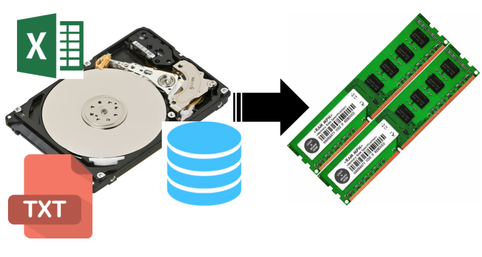
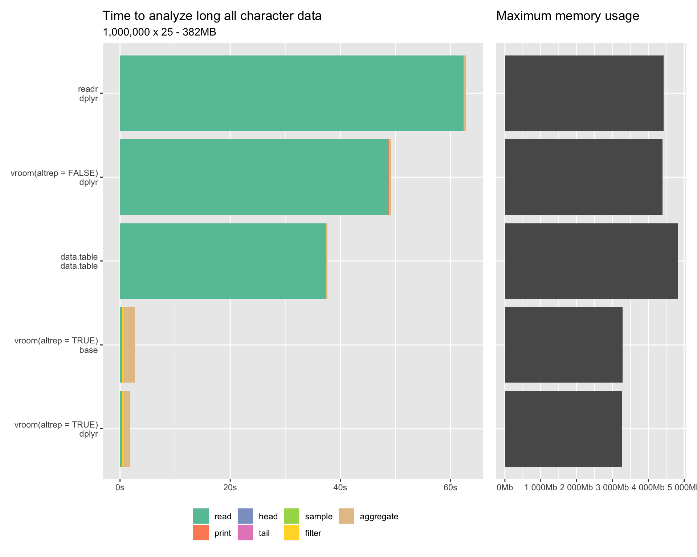

```{r, include=FALSE}
options(htmltools.dir.version = FALSE)
knitr::opts_chunk$set(comment = "#>", 
                      echo=FALSE, fig.align='center',
                      dpi = 300, out.width = "90%")
```

<!-- ----------------------------------------------------------------------- -->

# Submissão de exercícios

1. Utilização do Google Classroom.
2. Exercícios envolvem upload de arquivos.
3. Vamos checar os resultados durante a aula sempre que possível.
4. Ao final de cada exercício, o gabarito será disponibilizado.

---

# Última vez

📌 __Ambientação ao Git e Github__

📌 Manipulação avançada de dados

📌 Introdução à programação funcional

📌 Visualização avançada de dados

📌 Criação de pacotes

📌 Comunicação de resultados com dashboards (Shiny)

---

# Hoje

📌 Ambientação ao Git e Github

📌 __Manipulação avançada de dados__

📌 Introdução à programação funcional

📌 Visualização avançada de dados

📌 Criação de pacotes

📌 Comunicação de resultados com dashboards (Shiny)

---

# Primeiro passo

- Baixe o arquivo zip que está no Mural do Classroom e dezipe

```{r, echo=FALSE, out.width="70%"}
knitr::include_graphics("img/material_aula.png")
```


- Se estiver confiante, você pode clonar o repositório do GitHub 😄
- Abra o projeto (arquivo `.Rproj`) no RStudio

---
class: center


# Exercícios de hoje


.pull-left[

### Importação com `readr::`, `readxl::`

<br/>

### Revisão dplyr: pipe e 5 verbos

]

--

.pull-right[

### Banco de dados: `dplyr::` collect, postgres

<br/>

### Pivotagem: `tidyr::`

]

---

# Base de dados

Base do SINESP: Sistema Nacional de Informações de Segurança Pública

- `município`
- `sigla_uf`
- `regiao`
- `mes_ano`
- `vitima`

---

# Taxonomia

## ↪️ `{pacote}`

--

## ↪️ `pacote::funcao()` ou `funcao()`

--

## ↪️ `da_` para bases de dados

<!-- Parte 1---------------------------------------------------------------- -->

---

## O ciclo da ciência de dados

```{r, out.width="80%"}
knitr::include_graphics("img/ciclo-ciencia-de-dados.png")
```

---
## Importação

.pull-left[

<br>
- Arquivos de texto

- Arquivos do excel

- Arquivos de outros softwares (SAS, SPSS)

- Conexão com banco de dados
]

.pull-right[
<br>
```{r, out.width="100%", fig.align='center'}
knitr::include_graphics("img/arte_janitor.png")
```

]

---
## Manipulação

.pull-left[
<br>
- Selecionar colunas

- Filtrar linhas

- Criar ou modificar colunas

- Agrupar e sumarizar

- Juntar tabelas
]

.pull-right[

```{r, out.width="100%"}
knitr::include_graphics("img/arte_dplyr.png")
```

]

---
## Visualização

```{r, out.width="60%", fig.align='center'}
knitr::include_graphics("img/arte_ggplot2.png")
```

---
## Comunicação

- Relatórios automatizados
- Dashboards estáticos

```{r, out.width="60%", fig.align='center'}
knitr::include_graphics("img/arte_rmarkdown.png")
```

---

## O ciclo da ciência de dados com o R

```{r, out.width="80%"}
knitr::include_graphics("img/ciclo-ciencia-de-dados-pacotes.png")
```

---
class: inverse, middle, center

# Importação

---

# O que é importação

### Carregar uma base de dados numa `tibble` dentro do R.

```{r, out.width="80%"}

```

---

# O que é importação

### Carregar uma base de dados numa `tibble` dentro do R.

--

- Pode ser um arquivo `.csv` ou `.xlsx`.

--

- Pode ser um banco de dados local ou na nuvem.

--

- Pode ser um conjunto de arquivos `.html` brutos.

--

...e muito mais

---

# Tibble

- É o mesmo que um `data.frame()`
- Possui propriedades mais legais e imprime mais bonito.

```{r, echo=TRUE}
{{tibble::as_tibble(mtcars)}}
```

---

# Glimpse

- É o mesmo que `str()`, mas mais bonito e informativo.

```{r, echo=TRUE}
{{tibble::glimpse(mtcars)}}
```

---

# Pacotes de importação de dados

- Arquivos de texto: `{readr}`, `data.table::fread()`, `vroom::vroom()`

--

- Arquivos estruturados, como `xlsx` e `json`: `{readxl}`, `{jsonlite}`

--

- Banco de dados: `{DBI}`, `{odbc}` e pacotes específicos

--

- HTML e XML: `{xml2}`

---
class: center

# Vamos ao R!

```{r echo=FALSE, fig.align='center', out.width="80%"}
knitr::include_graphics("img/gato.gif")
```

---

# Exercício

1. Vá até a página [dados.gov.br](https://dados.gov.br) e pesquise pela base do SINESP.
2. Baixe o arquivo do SINESP, como vimos, salvando no local apropriado.
3. Leia todas as bases numa lista.
    - __Dica__: utilize `purrr::map()` e `readxl::excel_sheets()`
4. Empilhe a base.
    - __Dica__: utilize a função `dplyr::bind_rows()`

---

# Extra: pacote {vroom}

.pull-left[

- Se precisar carregar bases maiores, considere o pacote `{vroom}`.
- Ele carrega tudo num piscar de olhos, pois processa os somente somente quando você usa.

]

.pull-right[

```{r, echo=FALSE, out.width="100%"}

```

]

---

# Extra: pacote {ckanr}

- O pacote `{ckanr}` permite baixar dados de sites do tipo CKAN direto para o R.

Exemplo:

```{r, eval=FALSE, echo=TRUE}
library(ckanr)
ckanr_setup("http://dados.gov.br")
pacote <- ckanr::package_search("SINESP")$results[[1]]
pacote
```

    <CKAN Package> 210b9ae2-21fc-4986-89c6-2006eb4db247 
      Title: Ocorrências Criminais - Sinesp
      Creator/Modified: 2019-01-26T00:30:09.272398 / 2020-04-16T13:24:22.446329
      Resources (up to 5): Dicionário de Dados, Dados Nacionais de 
      Segurança Pública - Municípios, Dados Nacionais de Segurança Pública - UF
      Tags (up to 5): DGI, DNSP, Dados Nacionais de Segurança Pública, 
      Dados Oficiais, senasp
      Groups (up to 5):

---

# Extra: pacote {ckanr}

```{r, eval=FALSE, echo=TRUE}
download.file(pacote$resources[[2]]$url, "sinesp.xlsx")
readxl::read_excel("sinesp.xlsx")
```

    # A tibble: 258 x 5                                                                            
       Município        `Sigla UF` Região `Mês/Ano`           Vítima
       <chr>            <chr>      <chr>  <dttm>               <dbl>
     1 Bujari           AC         NORTE  2018-01-01 00:00:00      1
     2 Cruzeiro do Sul  AC         NORTE  2018-01-01 00:00:00      8
     3 Feijó            AC         NORTE  2018-01-01 00:00:00      3
     4 Jordão           AC         NORTE  2018-01-01 00:00:00      1
     5 Mâncio Lima      AC         NORTE  2018-01-01 00:00:00      1
     6 Rio Branco       AC         NORTE  2018-01-01 00:00:00     31
     7 Rodrigues Alves  AC         NORTE  2018-01-01 00:00:00      2
     8 Sena Madureira   AC         NORTE  2018-01-01 00:00:00      1
     9 Senador Guiomard AC         NORTE  2018-01-01 00:00:00      1
    10 Tarauacá         AC         NORTE  2018-01-01 00:00:00      1
    # … with 248 more rows

---
class: inverse, middle, center

# Pausa

<!-- Parte 2---------------------------------------------------------------- -->

---
class: inverse, middle, center

# Revisão {dplyr}

---
class: middle

# Tidy data

> "Happy families are all alike; every unhappy family is unhappy in its own way." –– Leo Tolstoy

> "Tidy datasets are all alike, but every messy dataset is messy in its own way." –– Hadley Wickham


---

# O que é tidy data?

É uma base que une os conceitos da estatística (amostra, variável) e da informática (linhas, colunas)

### As observações estão nas linhas

--

### As variáveis estão nas colunas

--

### Os valores estão nas células

---

## Os 5 verbos do dplyr

`filter()`: selecionar observações (linhas) da base de dados

--

`arrange()`: ordenar de acordo com alguma variável (coluna)

--

`select()`: selecionar variáveis (colunas)

--

`mutate()`: modificar/criar variáveis do banco de dados

--

`summarise()`: sumarizar/agregar variáveis de uma base de dados

---

## 3 regras

* o primeiro argumento é sempre uma `tibble()`
* os outros argumentos descrevem o que você quer fazer
* todos os verbos retornam sempre um `tibble()`

Essas três regras fazem o uso do pipe (`%>%`) ser muito intuitivo.

OBS: Para quem não lembra do `%>%`:

```{r eval=FALSE, echo=TRUE}
# equivalente
funcao(param_a, param_b)
objeto %>% funcao(param_b)
```


---
class: center

# Vamos ao R!

```{r echo=FALSE, fig.align='center', out.width="80%"}
knitr::include_graphics("img/gato.gif")
```

---

# select()

Outras funções úteis de seleção

* `starts_with("abc")`: seleciona nomes que começam com "abc"

* `ends_with("xyz")`: seleciona nomes que terminam com "xyz"

* `contains("ijk")`: seleciona nomes que contêm "ijk"

* `matches("(.)\\1")`: seleciona nomes usando Expressões Regulares

* `num_range("x", 1:3)`: seleciona x1, x2 e x3


---
class: center

# Vamos ao R!

```{r echo=FALSE, fig.align='center', out.width="80%"}
knitr::include_graphics("img/gato.gif")
```

<!-- Parte 3---------------------------------------------------------------- -->

---
class: inverse, middle, center

# Bancos de dados


---

# Bancos de dados e R

No passado, a conexão com bancos de dados eram complicadas. Mas hoje em dia, graças ao `{tidyverse}`, tudo está facilitado. 

Basicamente, temos dois componentes para bancos de dados:

- __Componente de conexão/interação__: Cuida da conexão com a base de dados e das operações principais, como leitura, escrita e aplicação de queries SQL. Coordenada pelo pacote `{DBI}` e implementada internamente por diversos pacotes, um para cada tecnologia de banco de dados, como `{odbc}`, `{RPostgres}`, entre outros.

--

- __Componente de tradução__: Traduz operações feitas com o `{dplyr}` em queries do SQL, para que os seus códigos rodem no servidor de banco de dados. Coordenado pelo `{dbplyr}`.

---

# Referência principal

## [db.rstudio.com](https://db.rstudio.com)

- Contém tutoriais para praticamente qualquer banco de dados.
- Informações completas sobre todos os pacotes.
- A partir desse site, você pode pesquisar pelos pacotes específicos.

---
class: center

# Vamos ao R!

```{r echo=FALSE, fig.align='center', out.width="80%"}
knitr::include_graphics("img/gato.gif")
```

<!-- Parte 4---------------------------------------------------------------- -->

---
class: inverse, middle, center

# Pivotagem

---

# pivot_wider()

```{r}
knitr::include_graphics("img/wider.png")
```

(retirado do livro [r4ds](https://r4ds.had.co.nz))

---

# pivot_longer()

```{r}
knitr::include_graphics("img/longer.png")
```

(retirado do livro [r4ds](https://r4ds.had.co.nz))

---
class: center

# Vamos ao R!

```{r echo=FALSE, fig.align='center', out.width="80%"}
knitr::include_graphics("img/gato.gif")
```

<!-- Finalizando ----------------------------------------------------------- -->

---
class: inverse, middle, center

# Resumo

---

# Resumo

Hoje vimos alguns conceitos de

- Importação de dados com `{readxl}` e `{readr}`, e uma palhinha do `{purrr}`
- Os cinco verbos do `{dplyr}`
- Conexão com banco de dados e a função `collect()`
- Pivotagem com as funções `pivot_wider()` e `pivot_longer()`

---

# Algumas referências

- [Material de tidyverse da UFPR](http://www.leg.ufpr.br/~walmes/ensino/dsbd-linprog/slides/02-r-tidyverse.html#1)
- [Material da Curso-R](https://www.curso-r.com/material/)
- [Apresentação Garret Grolemund](https://github.com/rstudio/webinars/blob/master/05-Data-Wrangling-with-R-and-RStudio/wrangling-webinar.pdf)

---

# Próxima aula

### `dplyr::` joins

### `tidyr::` nest/unnest

### `tidyr::` separate/unite

### `dplyr::` curly-curly

---
class: inverse, middle

# Obrigado!
