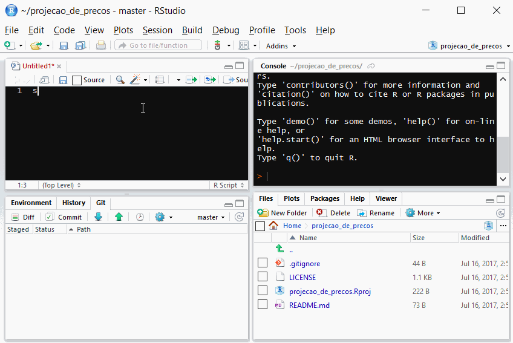
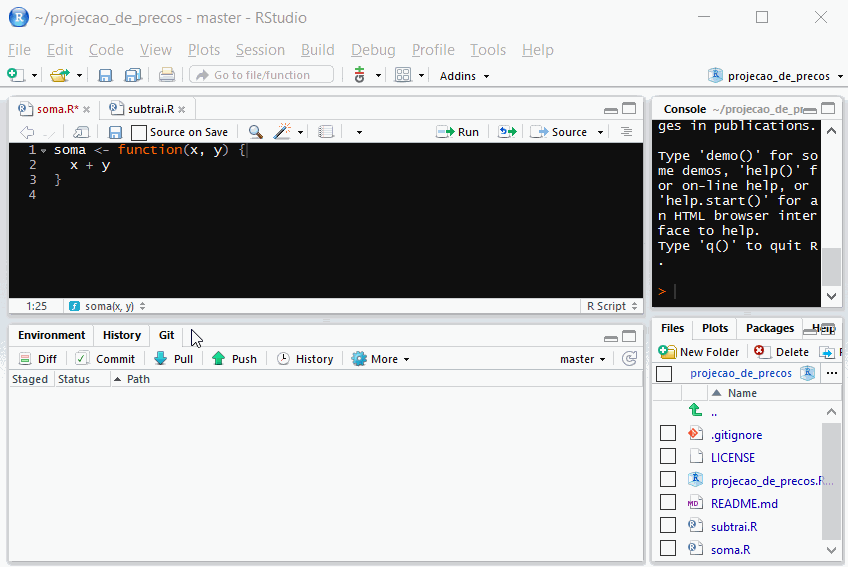

```{r setup, include=FALSE}
`%>%` <- magrittr::`%>%`

blue <- function(x) {
  glue::glue(
    '<span style="color:#6495ed; font-weight: bold;">{x}</span>'
  ) %>% 
    htmltools::HTML()
}

colorido <- function(x, cor) {
  glue::glue(
    '<span style="color:{cor}; font-weight: bold;">{x}</span>'
  ) %>% 
    htmltools::HTML()
}

options(width = 85)
```

# Organização de projetos

---

# Organização de projetos

- Existem diversas formas de organizar projetos de ciência de dados.
- Todas essas formas têm vantagens e desvantagens.
- Na prática, tudo fica bagunçado e confuso.

```{r echo=FALSE, fig.align='center'}

```

---

# O maior problema: coesão

- Uma forma de organizar projetos pode ser excelente para um tipo de projeto específico, mas ruim para outros.
- Isso sugeriria que, para cada projeto, deveríamos ter uma estrutura diferente de arquivos.
- No entanto, isso não é verdade.
- Mais importante do que discutir qual é a estrutura ideal para um caso específico, é escolher um __protocolo__ para seguir em todos os projetos.
- Isso tira da nossa mente a necessidade de pensar sobre a estrutura, para que possamos colocar nosso foco na análise de dados.

--

### Será que existe protocolo a ser seguido em projetos de R?

---
class: center, inverse, middle

# Sim

---

# Pacotes

- Neste curso, vamos trabalhar com projetos desenvolvidos através de __pacotes__. 
- Um pacote do R nada mais é do que uma forma específica de organizar seus código, seguindo o protocolo descrito pela R Foundation.
- Utilizaremos os pacotes `usethis` e `devtools` para nos ajudar.

```{r echo=FALSE, fig.align='center'}
knitr::include_graphics("img/pacote.gif")
```

---

# Vantagens e desvantagens

### Vantagens

- Padronização
- Integração com pacotes que aceleram desenvolvimento

--

### Desvantagens

- Em alguns projetos, esse protocolo será ineficiente, é verdade. 
- Mesmo assim, no longo prazo os benefícios superam os custos.

---

# Referências

- Vamos focar nas partes mais importantes, sem dar muitos detalhes sobre questões específicas.

--

- [R Packages](https://r-pkgs.org), livro aprofundado sobre desenvolvimento de pacotes.

--

- [Zen do R](https://curso-r.github.io/zen-do-r/), livro em desenvolvimento pela Curso-R.

--

- [Apresentação da Bea Milz](https://beatrizmilz.github.io/RLadies-Git-RStudio-2019).


---

# Estrutura básica de um pacote

#### Essenciais:

- `DESCRIPTION`: É o arquivo que define o nome do seu pacote
- `R/`: Aqui ficam suas funções desenvolvidas em R.

--

#### Dados:

- `data/`: Aqui ficam suas bases de dados finais.
- `data-raw/`: Aqui ficam seus scripts de arrumação e bases de dados intermediárias (70% do seu trabalho)

--

#### Comunicação:

- `docs/`: Sites, relatórios, dashboards estáticos.
- `vignettes/`: Documentação do pacote.

---

# É difícil?

## Sim.

- No início, vai parecer que é muita informação

--

- Existem várias regrinhas que a princípio não fazem sentido, mas ficarão mais claras à medida que vamos trabalhando.

---

# Vamos ao R!

```{r echo=FALSE, fig.align='center'}
knitr::include_graphics("img/gato.gif")
```


---

# Estrutura do pacote criado

- `R/`: pasta onde colocaremos nossas funções.

--

- `.gitignore`: tem a ver com o Git. Veremos mais para frente.

--

- `projeto.Rproj`: projeto do RStudio.

--

- `DESCRIPTION`: forma estruturada de descrever o pacote e suas dependências.

--

- `.Rbuildignore` e `NAMESPACE`: Cuida de coisas mais avançadas que não discutiremos no curso.

---

# Funções principais do usethis

- `usethis::create_package()`: cria seu pacote. 
    - Nomes só podem conter letras, números e pontos, devem começar com uma letra e não podem acabar com um ponto.
    - Você pode passar um caminho complexo como `~/Downloads/MeuProjeto` e tudo funcionará como esperado

--

- `usethis::use_mit_license()`: adiciona uma licença MIT ao seu pacote. 

--

- `usethis::use_readme_rmd()`: cria um `README` para seu pacote, no formato RMarkdown.

--

- `usethis::use_data()`: cria uma pasta `data/` se ela não existe, e salva sua base de dados final para fazer parte se seu pacote.

---

# Funções principais do devtools

- `devtools::load_all()`: carrega todas as funções da pasta `R/` e as bases salvas na pasta `data/`.

--

- `devtools::document()`: prepara as suas funções documentadas para fazer funcionar o help das funções.

--

- `devtools::install()`: instala o pacote que você criou. Utilizar somente quando seu pacote estiver pronto.

---

# Documentação da função

```{r eval=FALSE}
#' Título da função
#'
#' Descrição da função
#' 
#' @param a primeiro parâmetro
#' @param b segundo parâmetro
#' 
#' @return descrição do resultado
#' 
#' @export
fun <- function(a, b) { 
  a + b
}
```


---

# Vamos ao R!

```{r echo=FALSE, fig.align='center'}
knitr::include_graphics("img/gato.gif")
```

---

# Exercício 01: Seu primeiro pacote

1. Utilize `usethis::create_package()` para criar seu primeiro pacote.
2. Crie uma função chamada `colar`, que recebe os parâmetros `x` e `y` e retorna eles colados, com um espaço de separação. 
3. Documente a função e adicione `@export`.
4. Rode `devtools::document()` e `devtools::load_all()`
5. Rode `?colar`
6. Rode com seu nome: `colar("Jane", "Doe")`
7. Tire um print screen de seu RStudio, mostrando i) o código que define a função, ii) o Help da função `colar` e iii) o resultado da operação `colar()` com o seu nome.
8. Submeta a imagem no Google Classroom.

---

# Por quê na pasta R/ só pode ter funções?

- Uma função é responsável por executar uma tarefa pequena, mas muito bem.

--

- Quando trabalhamos com funções, nossas operações ficam mais confiáveis.

--

- A ideia da pasta `R/` é guardar em um local comum tudo aquilo que nós utilizamos como ferramenta interna para nossas análises, bem como aquilo que queremos que outras pessoas possam usar no futuro.

---

# Qual a diferença entre R/ e data-raw/?

### data-raw

- A pasta `data-raw/` é sua caixa de areia.
- Apesar de existirem formas razoáveis de organizar seus pacotes aqui, nessa parte você será livre

--

### R/

- Já a pasta `R/` conterá funções bem organizadas e documentadas.
- Por exemplo, uma função que ajusta um modelo estatístico, outra que arruma um texto de um jeito patronizado, ou uma que contém seu tema customizado do `ggplot`.
- Não carregar outros pacotes com `library()`. Usar operador `::`.

---
class: middle, inverse

# Pausa

---
class: center, middle, inverse

# Git e GitHub

---

# Git e Github

.pull-left[

O que veremos

- Motivação
- Criar um repositório
- Conceitos de *clone*, *stage*, *commit*, *pull*, *push*
- Fluxo de trabalho
- Principais cuidados

Requisitos (Aula Zero)

- Uma conta no GitHub
- Git instalado na sua máquina
- RStudio instalado

]

--

.pull-right[

**Se você ainda não tiver as coisas instaladas, faça agora. Se tiver dificuldades, chame o monitor.**

Seguiremos o excelente livro [Happy Git with R](https://happygitwithr.com/), feito pela Jenny Bryan. Se tiver dúvidas, pode seguir por lá.

]


---

# Por quê Git?


```{r echo=FALSE, out.width="40%", fig.align='center'}
knitr::include_graphics("img/git.png")
```


- Git é um **sistema de versionamento**.
- Foi criado em 2005 por Linus Torvalds, autor do sistema Linux.
- É capaz de guardar o histórico de alterações de todos os arquivos dentro de uma pasta, que chamamos de repositório.
- Funciona como o "*Track changes*" do word, mas muito melhor.
- Torna-se importante à medida que seu trabalho é __colaborativo__.


### Git é o software que você instala no computador.


---

# Por quê GitHub?

```{r echo=FALSE, out.width="40%", fig.align='center'}
knitr::include_graphics("img/github.png")
```


- GitHub é um site onde você coloca e compartilha repositórios Git.
- Utilizado por milhões de pessoas em projetos de código aberto ou fechado.
- Útil para colaborar com outros programadores em projetos de ciência de dados.
- Forma segura de guardar os códigos que você desenvolve.
- Existem alternativas, como [GitLab](https://about.gitlab.com/) e [BitBucket](https://bitbucket.org/product).

### GitHub é o site que você acessa na internet.

---

# É difícil?

### Sim.

- O Git tem uma série de comandos esquisitos e raramente é intuitivo, mesmo para programadores experientes.
- Na prática, sempre que você tiver problemas precisará perguntar ao Google ou consultar no Happy Git with R.

--

### Vantagem: o RStudio é facilita MUITO a nossa vida.

---

# Pacotes e GitHub

- No nosso caso, pacote e repositório serão sinônimos

--

- Pacotes do R e o GitHub são melhores amigos.

--

- O grande cupido dessa amizade colorida é o `usethis`.

---

# Simplificando tudo: usethis

- O pacote `usethis` ajuda com todo o fluxo de desenvolvimento em R

- Ele pode ajudar com criar projetos, repositórios no GitHub e muito mais

```{r echo=FALSE, out.width="15%", fig.align='center'}
knitr::include_graphics("img/usethis.png")
```

---

# Fluxo de trabalho

```{r echo=FALSE, fig.align='center', out.width="70%"}
knitr::include_graphics("img/fluxo_github_rstudio.png")
```

---

# Passo 1: Crie e configure seu pacote

```{r eval=FALSE}
usethis::create_package("meuPacote")
```

Lembrando que nomes de pacotes

- Só podem ter letras, números e ponto
- Devem começar com uma letra
- Não podem acabar com ponto

---

# Passo 2: Adicione o Git

- Depois que o seu projeto estiver pronto, transforme ele em uma pasta com
controle de versão

```{r, eval=FALSE}
use_git()
```

- Rodando o comando acima na pasta do projeto (a nova aba do RStudio que
apareceu) você adiciona controle de versão

- Você receberá algumas instruções para seguir, mas está tudo certo

---

# Passo 2½: Configure seu usuário

Configure seu usuário do Git:

```{r eval=FALSE}
usethis::use_git_config(
  # Pode ser seu nome mesmo, não precisa ser o nickname
  user.name = "NOME", 
  # precisa ser o que está vinculado à sua conta do github
  user.email = "seu@email.com"
)
```

---

# Passo 3: Adicione o GitHub

```{r, eval=FALSE}
use_github()
```

- O comando acima sincroniza a pasta com o GitHub.

- Mais uma vez, você receberá algumas instruções, mas lembre-se apenas de selecionar o método de autenticação `https`.

---

# Personal Access Token

- Ao conectar com o GitHub, você será instruída(o) a criar um *Personal Access Token* (PAT).

--

- O PAT serve para autenticar ao github, podendo ser utilizado como senha de acesso ou internamente para automatizar tarefas (como criar um repositório).

--

- Para acessar seu PAT, rode `devtools::github_pat()`. 
- Se quiser editá-lo, rode `usethis::edit_r_environ()` e lembre-se de reiniciar sua sessão do R.

---

# Passo 4: Stage & Commit

```{r echo=FALSE, out.width="60%", fig.align='center'}

```

__Observação__: O ato de clicar no item é o passo de Stage.

---

# Passo 5: Push

```{r, echo=FALSE, out.width="60%", fig.align='center'}
knitr::include_graphics("img/passo_4_push.gif")
```

---

# Passo Extra: Pull

```{r, echo=FALSE, out.width="60%", fig.align='center'}

```

---

# Resumo

### 1. Repositório: Criar projeto/pacote
### 2. Adicionar Git
### 3. Adicionar GitHub
### 4. Commit: Edite e "Commite" as mudanças no código
### 5. Push: Suba os commits para o Github
### Extra. Pull: Baixe o estado atual do projeto

---

# Exercício 02

Siga os passos e não se esqueça de configurar seu usuário com `use_git_config()`!

1. Crie um pacote e adicione Git e o GitHub
2. Crie um script em R e adicione a função `colar()`, criada no exercício 1.
3. Commit & Push
4. Submeta o link de seu repositório no Google Classroom

---

# Cuidados

- Se uma base de dados tem mais do que 50Mb de tamanho, ela não deveria estar no seu repositório.

--

- Nem sempre o comando Pull dá certo. Às vezes, você e a colega de trabalho fizeram mudanças no mesmo arquivo e, quando vão juntar, ocorre um conflito.

---

# Considerações finais

- Se você acha que ficou boiando nessa aula, não se preocupe! A partir da próxima aula, vamos trabalhar com scripts "normais" do R.

--

- Git, GitHub e pacotes são temas complexos!

--

- Por enquanto, vimos somente alguns aspectos iniciais dessas ferramentas.

--

- No longo prazo, estudar esses assuntos pode aumentar sua produtividade exponencialmente.

--

- Lembre-se que os pacotes `{usethis}` e `{devtools}` estão sempre aí para te ajudar.


---

# Referências


