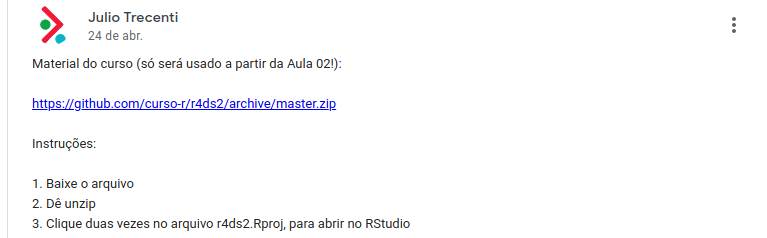

```{r, include=FALSE}
options(htmltools.dir.version = FALSE)
knitr::opts_chunk$set(comment = "#>", 
                      echo=TRUE, fig.align='center',
                      dpi = 300, out.width = "90%")
```

# Submissão de exercícios

1. Utilização do Google Classroom

2. Exercícios envolvem upload de arquivos

3. Vamos checar os resultados durante a aula sempre que possível

4. Ao final de cada exercício, o gabarito será disponibilizado

---
# Última vez

- Ambientação ao Git e Github

- __Manipulação avançada de dados__

- Introdução à programação funcional

- Visualização avançada de dados

- Criação de pacotes

- Comunicação de resultados com dashboards (Shiny)

---
# Hoje

- Ambientação ao Git e Github

- Manipulação avançada de dados

- __Introdução à programação funcional__

- Visualização avançada de dados

- Criação de pacotes

- Comunicação de resultados com dashboards (Shiny)

---
# Material do curso

- Baixe o arquivo zip que está no Mural do Classroom e dezipe

```{r, echo=FALSE, out.width="70%"}

```

- Se estiver confiante, você pode clonar / dar pull no repositório do GitHub

- Abra o projeto (arquivo `.Rproj`) no RStudio

---
# Base de dados

Base do estadual SINESP: Sistema Nacional de Informações de Segurança Pública
(já disponível no material do curso)

- `uf`

- `tipo_crime`

- `ano`

- `mes`

- `ocorrencias`

---
class: inverse, center, middle
# Strings

---
# Motivação

- Bases com colunas em texto já são _extremamente_ comuns hoje em dia

- Além de ajudar em análise de dados, tratar strings ajuda com programação

- O conhecimento de expressões regulares vale para a vida

- Normalmente os textos são bagunçados, então precisamos arrumá-los

---
# Introdução

- String não passa de uma sequência de caracteres ("cadeia" em português)

- No R podemos criar uma string com um par de aspas (simples ou duplas)

```{r}
cat("こんにちは! Está 10\u00BAC na lá fora")
```

- Para colocar aspas dentro de uma string, podemos __escapar__ o caractere

```{r}
cat("Ele disse \"escapar\"")
```

---
# O pacote {stringr}

- O pacote `{stringr}` é a forma mais simples de trabalhar com strings no R

```{r}
library(stringr)

abc <- c("a", "b", "c")
str_c("prefixo-", abc, "-sufixo")
```

- Todas as funções relevantes começam com `str_` e funcionam bem juntas

```{r}
abc %>%
  str_c("-sufixo") %>%
  str_length()
```

---
# Regex

- __Expressões regulares__ são "programação para strings", permitindo extrair
padrões bastante complexos com comandos simples

```{r}
frutas <- c("banana", "TANGERINA", "maçã", "lima")
str_subset(frutas, pattern = "na")
```

- Símbolos como `.` (qualquer caractere), `^` (início da string) e `$` (fim da
string) ajudam a criar padrões mais complexos

```{r}
str_subset(frutas, pattern = "^ma")
```

---
# Mais regex

- Podemos contar as ocorrências de um padrão: `+` (1 ou mais vezes), `*` (0 ou
mais vezes), `{m,n}` (entre `m` e `n` vezes)

```{r}
ois <- c("oi", "oii", "oiii!")
str_extract(ois, pattern = "i+")
```

- Para determinar um conjunto de caracteres válidos, usamos `[]`

```{r}
str_extract(ois, pattern = "[i!]$")
```

---
# Ainda mais regex

- Se de fato precisarmos encontrar um dos __caracteres reservados__, precisamos
escapá-los da mesma forma como vimos antes

```{r}
str_replace("Bom dia.", pattern = "\\.", replacement = "!")
```

- Não esquecer que algumas funções do `{stringr}` possuem variações

```{r}
str_replace_all("Bom. Dia.", pattern = "\\.", replacement = "!")
```

---
# Vamos ao R!

```{r echo=FALSE, fig.align='center', out.width="80%"}
knitr::include_graphics("img/gato.gif")
```

---
class: inverse, center, middle
# Datas

---
# Motivação

- Datas e horas são provavelmente os dados mais delicados

- Realizar operações com tempo é algo bastante difícil

- Diversas fontes de dados contém datas mal formatadas

- Entender como o tempo funciona em programação é muito valioso

---
# Introdução

- O problema das datas e data-horas é que elas são valores numéricos (segundos
desde o início do universo) expressos com strings

```{r, message=FALSE}
library(lubridate)
now()
as.numeric(now())
```

- O formato utilizado pelas linguagens de programação para data-horas se chama
ISO 8601 e é o _único_ que sempre funciona

---
# O pacote {lubridate}

- O pacote `lubridate` vai nos possibilitar trabalhar com datas e data-horas
fora do ISO 8601

- O formato brasileiro é `dia/mês/ano hora:minuto:segundo`

```{r}
dmy_hms("06/05/2020 02:25:00")
```

- Possível também trabalhar só com datas ou horas

```{r}
dmy("06/05/2020")
```

---
# Componentes

- Extrair os componentes de uma data pode ser importante para uma análise

```{r}
month("2020-05-06")
```

- Podemos também somar dias, horas, minutos, etc.

```{r}
today() + 2
now() + days(5)
```

---
# Operações

- Com os operadores matemáticos normais também somos capazes de calcular
distâncias entre datas e horas

```{r}
dif <- dmy("06/05/2020") - dmy("04/05/2020")
```

- Podemos transformar um objeto de diferença temporal em qualquer unidade que
queiramos

```{r}
dif
as.period(dif) / minutes(1)
```

---
# Vamos ao R!

```{r echo=FALSE, fig.align='center', out.width="80%"}
knitr::include_graphics("img/gato.gif")
```

---
class: inverse, center, middle
# Iterações

---
# Motivação

- A iteração é um dos padrões mais comuns em qualquer tarefa de programação

- Entender bem como uma iteração funciona pode facilitar a vida

- Padrões mais seguros de iteração podem deixar o código mais limpo

- É comum precisar repetir uma tarefa várias vezes na ciência de dados

---
# Introdução

- __Iteração__ não é nada mais do que a repetição de um trecho de código várias
vezes

```{r}
vec <- 1:10
for (i in seq_along(vec)) {
  vec[i] <- vec[i] + 10
}
vec
```

- Note como a única coisa que fazemos é aplicar uma operação em cada elemento do
vetor

- Identificamos algumas estruturas: entrada (vetor de 1 a 10), função (somar 10),
formato da saída (um vetor numérico)

---
# O pacote {purrr}

- O pacote `{purrr}` nos permite simplificar iterações e integrá-las a pipelines
do `{tidyverse}`

```{r}
library(purrr)

soma_dez <- function(x) x + 10
map_dbl(vec, soma_dez)
```

- `map_` denota a iteração, `vec` é a entrada, `soma_dez()` é a função e `dbl`
é o formato da saída (_double_)

- Note que o `map()` passa os elementos do vetor para o __primeiro__ argumento
da função `soma_dez()`

---
# Funções

- Para passar outros arugmentos (fixos) a uma função, basta adicioná-los ao
`map()`

```{r}
soma_n <- function(x, n) x + n
map_dbl(vec, soma_n, n = 3)
```

- Para simplificar funções simples, podemos usar uma notação __lambda__ na qual
`.x` representa onde deve ir o elemento do vetor

```{r}
map_dbl(vec, ~3+.x)
```

---
# Extras

- Se for necessário iterar em duas listas, basta usar `map2()`

```{r}
strings <- c("oiii", "como vai", "tchau")
padroes <- c("i+",   "(.o){2}",  "[au]+$")
map2_chr(strings, padroes, str_extract)
```

- E, se for mais útil não especificar o formato de saída, basta usar as versões
puras dos `map()`s

```{r}
map2(strings, padroes, str_extract)
```

---
# Vamos ao R!

```{r echo=FALSE, fig.align='center', out.width="80%"}
knitr::include_graphics("img/gato.gif")
```

---
class: inverse, middle, center
# Programando com dplyr

---
# Motivação

- O `{dplyr}` facilita a nossa vida ao permitir colocar os nomes das variáveis
sem aspas nos argumentos das funções principais

- Isso só é possível por conta de um recurso quase exclusivo do R, chamado de
*non standard evaluation* (NSE)

- No entanto, quando queremos criar funções, isso pode atrapalhar

```{r eval=FALSE, echo=TRUE}
selecionar <- function(da, coluna) {
  da %>% 
    select(coluna)
}

da_sinesp_muni %>% 
  selecionar(regiao)
```
    
    #> Error: object 'regiao' not found

---
# Programando com R

- Para isso, existe o curly-curly `{{ }}`

- Basta colocá-lo ao redor do argumento que você quer passar

```{r eval=FALSE, echo=TRUE}
selecionar <- function(da, coluna) {
  da %>% 
    select({{coluna}})
}

da_sinesp_muni %>% 
  selecionar(regiao)
```

    # A tibble: 124,246 x 1
       regiao
       <chr> 
     1 NORTE 
     2 NORTE 
     3 NORTE 
     4 NORTE 
     5 NORTE 
     6 NORTE 
     7 NORTE 
     8 NORTE 
     9 NORTE 
    10 NORTE 
    # … with 124,236 more rows

---
# Vamos ao R!

```{r echo=FALSE, fig.align='center', out.width="80%"}
knitr::include_graphics("img/gato.gif")
```

---
# Resumindo

- Use `{{variavel}}` quando não quiser colocar aspas no argumento da função.

- Use `.data[["variavel"]]` quando quiser colocar aspas no argumento da função.

- Use `{{nome}} := ...` quando quiser criar colunas com nomes que estão no argumento da função.

__Referência__: https://www.curso-r.com/blog/2019-08-21-nse/

---
class: inverse, center, middle
# Obrigado!
