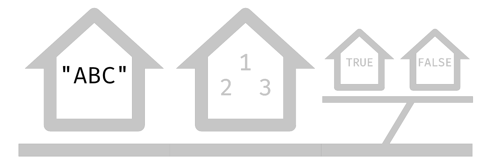

```{r setup, include=FALSE}
options(htmltools.dir.version = FALSE)
knitr::opts_chunk$set(comment = "#>")
options(dplyr.print_min = 5, dplyr.print_max = 5, dplyr.width = 70)
```

class: middle, center
# Iniciar gravação!

---
class: middle, center, inverse
# Listas

---
# Motivação

Listas são uma das estruturas de dados mais fundamentais do R. Na verdade, data
frames não passam de listas bonitinhas! Entender como elas funcionam vai nos
ajudar a entender melhor como o R trabalha por trás dos panos.

Já aprendemos muito sobre vetores e listas são apenas uma generalização desse
conceito. Nosso objetivo é saber usar ambos com a mesma facilidade, pois assim
também teremos mais uma ferramenta no nosso arsenal.

Listas, além de tudo isso, têm um papel central no pacote purrr e na programação
funcional dentro do R; não faz sentido falarmos do `map()` sem antes entender a
sua saída. Grande parte das funções do purrr existem para manipular listas,
convertê-las para vetores e vice-versa.

O que então faz com que as listas sejam tão especiais? O que as diferencia dos
vetores e porque não podemos usar uma só estrutura de dados para tudo? Vamos
começar do começo: como criar uma lista.

---
# list()

Para criar uma lista basta usar a função `list()`. Cada elemento ganha um
**índice** (entre colchetes duplos) e um **valor** (logo abaixo do índice).

.pull-left[

```{r}
list(1, 2, 3)
```

]

.pull-right[

Como listas costumam ficar longas, usar a função `str()` pode facilitar a
leitura da saída.

```{r}
str(list(1, 2, 3, 4))
```

]

---
# Listas nomeadas

Se não declararmos nada, os índices dos elementos são sempre numéricos como no
slide anterior. Uma alternativa é dar nomes para os elementos, assim os índices
ficam mais descritivos.

```{r}
list(um = 1, dois = 2, tres = 3)
```

Neste caso, ao invés de `[[]]`, os nomes dos elementos são precedidos por um
`$`.

---
# Heterogeneidade: tipos

.pull-left[

Vetores no R são homogêneos, ou seja, só aceitam um tipo de dado. Se tentarmos
juntar vários tipos, eles são convertidos para ficarem uniformes.

```{r}
c(TRUE, 123, "ABC")
```

Esse processo é conhecido como **coerção** e, no geral, não queremos que isso
aconteça.

]

.pull-right[

Listas, por sua vez, são **heterogêneas**: elas aceitam qualquer tipo de dado!
Podemos misturar tudo à vontade sem nos preocupar com coerção.

```{r}
list(TRUE, 123, "ABC")
```

]

---
# Heterogeneidade: comprimentos

Além de misturar tipos, podemos misturar elementos de diferentes comprimentos.
Uma lista pode conter vetores e até sub-listas!

```{r}
str(list(
  objeto = "abc",
  vetor = c(1, 2, 3),
  lista = list(TRUE, FALSE)
))
```

---
# Indexação

Acessar elementos de listas é um pouco mais complicado do que vetores. A base é
a mesma: `[i]` retorna a `i`-ésima posição. O problema é que, nas listas, existe
uma diferença entre a **posição** de um elemento e o **elemento** em si.

A `i`-ésima posição, em uma lista, sempre é uma **sub-lista**. Para pegar o
`i`-ésimo elemento, precisamos usar `[[i]]`! Alternativamente, em listas
nomeadas, podemos usar `["nome"]` e `[["nome"]]` (equivalente a `$nome`).

Os slides a seguir mostram várias maneiras de acessar os elementos e posições da
lista `l`, idêntica à do slide anterior.

```{r}
l <- list(
  objeto = "abc",
  vetor = c(1, 2, 3),
  lista = list(TRUE, FALSE)
)
```

---
# Indexação: rua completa

Vamos pensar em listas como ruas. Quando usarmos `[i]` obteremos um trecho da
rua e quando usarmos `[[i]]` obteremos a família da casa correspondente.

Seguindo a lógica da metáfora, um vetor é uma casa com vários moradores e uma
sub-lista é uma vila.

```{r, echo = FALSE}

```

---
# Indexação: casa 1

```{r, eval = FALSE}
l[1]
l["objeto"]
```

```{r, echo = FALSE}

```

---
# Indexação: casas 2 e 3

```{r, eval = FALSE}
l[2:3]
l[c("vetor", "lista")]
l[-1]
```

```{r, echo = FALSE}

```

---
# Indexação: família da casa 1

```{r, eval = FALSE}
l[[1]]
l[["objeto"]]
l$objeto
```

```{r, echo = FALSE}

```

---
# Indexação: família da casa 2

```{r, eval = FALSE}
l[[2]]
l[["vetor"]]
l$vetor
```

```{r, echo = FALSE}

```

---
# Indexação: vila

```{r, eval = FALSE}
l[[3]]
l[["lista"]]
l$lista
```

```{r, echo = FALSE}

```

---
# Indexação: casa 1 da vila

```{r, eval = FALSE}
l[[3]][1]
l[["lista"]][1]
l$lista[1]
```

```{r, echo = FALSE}

```

---
# Indexação: família da casa 1 da vila

```{r, eval = FALSE}
l[[3]][[1]]
l[["lista"]][[1]]
l$lista[[1]]
```

```{r, echo = FALSE}

```

---
# Rodada bônus!

Data frames são um tipo especial de lista e por isso podemos usar o `$` para
acessar colunas. A única restrição é que os elementos precisam ter o mesmo
tamanho.

```{r, message = FALSE}
library(tidyverse)
as_tibble(list(
  col1 = c("a", "b"),
  col2 = c(1, 2),
  col3 = c(TRUE, FALSE),
  col4 = list(c(1, 3), 2) # list-column!
))
```

---
class: middle, center, inverse
# purrr

---
# Motivação

O objetivo do pacote purrr é trazer programação funcional (PF) para o R de forma
consistente. PF, como sugere o nome, gira em torno de funções: a maior parte das
funções recebe outras funções como entrada.

O purrr também lida com iterações, simplificando muito o processo que vimos aula
passada. Se planejarmos bem nossas funções, quase nunca mais precisaremos pensar
em `for`s ou `while`s.

Por fim, a estrutura de dados base do purrr é a lista. Por padrão, quase todas
as funções dele aceitam listas como entrada e retornam listas como saída. A
importância da primeira parte da aula vai ficar evidente a partir de agora.

No limite, a sintaxe do purrr é capaz de mudar para sempre o modo como
programamos, ensinando padrões robustos de programação (sem efeitos colaterais e
sem repetição de código). Mas como isso é possível? Vamos começar simplificando
o que vimos na seção anterior...

---
# Simplificando indexação

A primeira utilidade do purrr já aparece na indexação de listas. Ao invés de
usar colchetes duplos, podemos simplesmente usar a função `pluck()`.

```{r}
pluck(l, 3, 2) # Equivale a l[[3]][[2]]
```

A dupla `keep_at()` / `discard_at()` filtra listas. Ambas recebem um vetor de
nomes ou posições e mantém / descartam os elementos daqueles índices.

```{r}
keep_at(l, c("objeto")) # Equivale a l[c("objeto")]
```

Agora vamos falar da parte legal do pacote...

---
class: middle, center

```{r, echo = FALSE, out.width="92%", fig.align='center'}
knitr::include_graphics("img/05_funcional/purrr.png")
```

[Ilustração por @allison_horst](https://twitter.com/allison_horst)

---
# O pacote purrr

A funcionalidade que mais vamos usar do purrr é simplificar loops `for` e
`while`. Vamos analisar o loop a seguir para tentar entender quais são as
estruturas importantes.

```{r}
comprimentos <- c()
for (i in seq_along(l)) {
  comprimentos[i] <- length(l[[i]])
}
comprimentos
```

Notem como só existem dois elementos principais: um **entrada** (a lista `l`) e
uma **função** sendo aplicada em cada elemento da entrada (`length()`). O vetor
intermediário `comprimentos` é só uma distração, pois ele só guarda resultados.

---
# map()

A função `map()` tem dois argumentos: uma entrada e o nome de uma função. A
função será aplicada em cada elemento do vetor ou da lista de entrada.

```{r}
map(l, length)
```

Se a entrada for uma lista nomeada, esses nomes serão preservados na saída.

---
# map(): função

A função que a `map()` recebe deve precisar de apenas 1 argumento. A função em
si pode receber vários argumentos, mas só o primeiro deve ser obrigatório.

```{r}
longo <- function(elemento, limite = 1) {
  length(elemento) > limite
}
map(l, longo)
```

---
# map(): saída

Como deve ter dado para reparar, a `map()` sempre retorna uma lista. Isso
acontece porque ela não sabe o que a sua função vai retornar, então um vetor
pode nem sempre funcionar.

.pull-left[

```{r}
media <- function(x) {
  if (!is.numeric(x)) {
    return("Erro")
  }
  mean(x)
}
```

A função média retorna uma string se a entrada não for numérica e um número caso
contrário.

]

.pull-right[

```{r}
map(l, media)
```

]

---
# Achatamento

Se não quisermos uma lista de saída e tivermos _certeza_ que nossa função sempre
retorna objetos do mesmo tipo, podemos usar a `map_vec()`. Ela faz o máximo
possível para garantir que a saída seja um vetor.

```{r}
nums <- list(1:2, 1:3, 1:4)
map_vec(nums, length)
```

Alternativamente podemos usar a `list_c()`, que achata uma lista qualquer sem
precisar de uma função para ser aplicada.

```{r}
list_c(nums)
```

---
# Achatamento: data frames

Uma operação comum é ler um vetor de arquivos com a `map()`. Se fizermos isso e
a saída da leitura for uma data frame, podemos empilhá-las com `list_rbind()`.

```{r, message = FALSE}
c("../dados/imdb_2015.csv", "../dados/imdb_2016.csv") |>
  map(read_csv) |>
  list_rbind() |>
  select(1:4) |>                    # Reduzir saída
  filter(str_detect(titulo, "War")) # Reduzir saída
```

---
# map2()

Se tivermos 2 vetores ou listas do mesmo comprimento e uma função que recebe 2
argumentos, podemos usar a `map2()` (ou `map2_vec()`) para iterar em ambos.

```{r}
comprimento <- function(x, nome) {
  str_c(nome, " tem ", length(x), " elemento(s)")
}
map2(l, names(l), comprimento)
```

---
# pmap()

A generalização do par `map2()` / `map2_vec()` é o par `pmap()` / `pmap_vec()`.
Neste caso, passamos uma lista com todas as entradas que vão para a função.

```{r}
tipo <- function(x, classe, nome) {
  str_c(nome, " é ", classe, " (tamanho ", length(x), ")")
}
pmap(list(l, map(l, class), names(l)), tipo)
```

---
# Funções anônimas

Uma coisa que começa a incomodar é sempre ter que declarar uma função do lado de
fora da `map()`. Se nossa função tiver apenas uma linha, podemos usar a notação
de **função anônima**: `\()`.

Uma função anônima não precisa de um nome, então podemos declará-la diretamente
dentro de uma chamada. Isso funciona com qualquer função que recebe o nome de
outra função como argumento!

```{r}
map2_vec(
  list(1:2, 1:3, 1:4),
  c(3, 2, 6),
  \(vec, lim) length(vec) > lim
)
```

---
# List-columns

Como vimos rapidamente na seção anterior, data frames aceitam listas como
colunas, as **list-columns**. A lista em si precisa ter o mesmo comprimento da
tabela, mas os seus elementos não estão sob a mesma restrição.

```{r}
df <- tibble(
  nome = c("Bacon", "Dexter", "Zip"),
  cor = list(c("branco", "marrom"), "caramelo", "branco")
)
df
```

---
# List-columns: map()

Um dos jeitos mais simples de criar uma list-column é com o resultado de uma
`map()`. Imagine que queremos fazer uma operação que retorne vários elementos
para cada linha da tabela:

```{r}
df |>
  mutate(frase = map2(nome, cor, \(n, c) str_c(n, " é ", c)))
```

Apesar de a `str_c()` ser vetorizada, ela não funciona se cada elemento tem
tamanhos diferentes.

---
# List-columns: unnest()

A função `unnest()` do tidyr é perfeita para expandir list-columns em colunas
normais. Passamos um vetor com colunas que tenham a mesma estrutura e a tabela
ganha mais linhas.

```{r}
df |>
  mutate(frase = map2(nome, cor, \(n, c) str_c(n, " é ", c))) |>
  unnest(c(cor, frase))
```

---
# List-columns: nest()

Às vezes queremos também fazer a operação contrária. Agrupando por `.by`, a
função `nest()` cria uma list-column com todas as colunas que quisermos.

```{r}
df |>
  mutate(frase = map2(nome, cor, \(n, c) str_c(n, " é ", c))) |>
  unnest(c(cor, frase)) |>
  nest(info = c(cor, frase), .by = nome)
```

Note como aqui o resultado é uma coluna de **sub-tabelas**!

---
# Rodada bônus!

Até pouco tempo atrás, a notação `\()` não existia. Se vocês virem código
antigos, pode ser que eles usem a notação `~`.

```{r, eval = FALSE}
\(arg1, arg2) sum(is.na(arg1), is.na(arg2)) # Notação nova
~ sum(is.na(.x), is.na(.y))                 # Notação antiga
```

Apesar de mais compacta, a notação antiga não permite escolher o nome dos
argumentos (o primeiro é sempre `.x`, o segundo `.y`, etc.). Ela também só
funcionava nas funções do tidyverse, então não podíamos usá-la sempre; a `\()`,
por exemplo, funciona em pipelines:

```{r}
df |>
  { \(tabela) c(nrow(tabela), ncol(tabela)) }()
```

---
class: middle, center, inverse
# Fim
